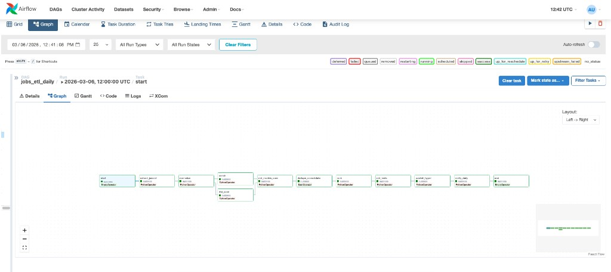
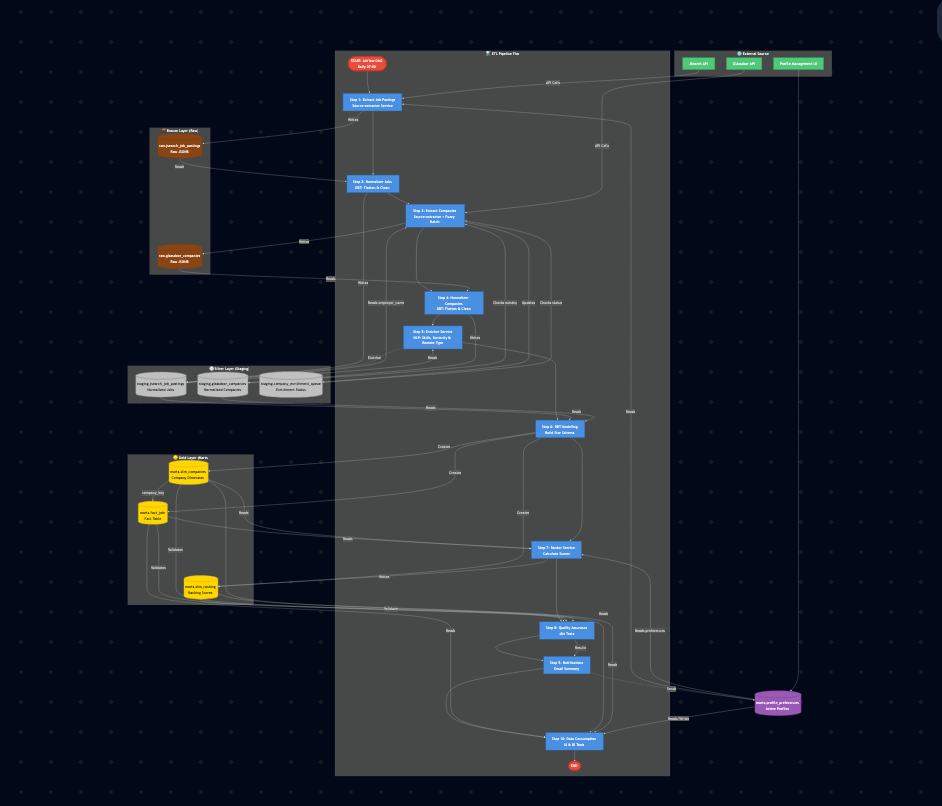
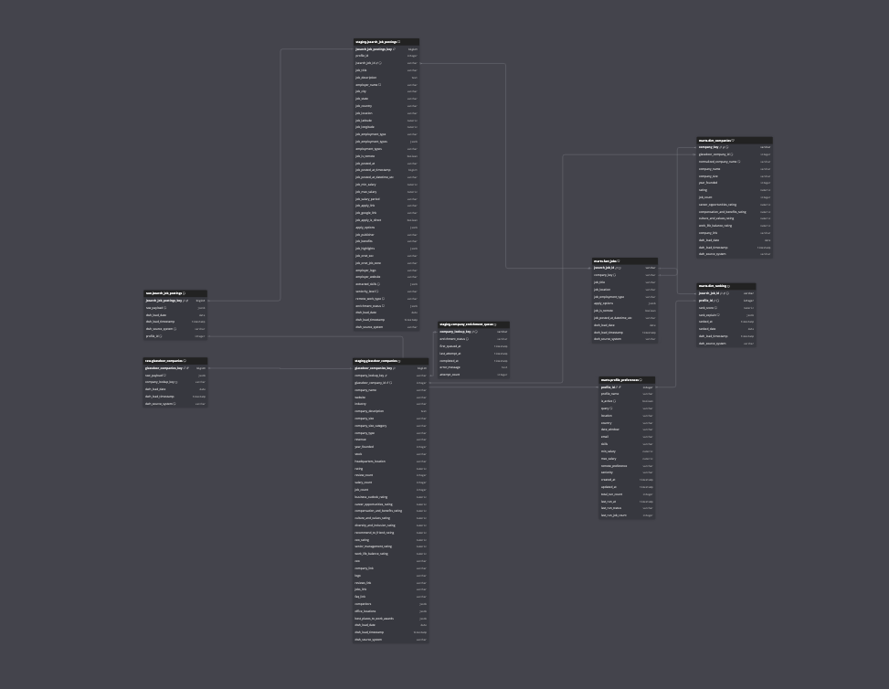

# Job Postings ETL Pipeline

[](https://github.com/filmozolevskiy/job-etl/actions/workflows/ci.yml)

A modular ETL pipeline that ingests job postings from different third‑party APIs, normalizes and enriches them with skills extraction, ranks them and loads them to the final tables.

**Key Features**

- **Modular ELT** – microservices for extract, normalize, enrich, rank, publish
- **Skills extraction** – spaCy + YAML keyword rules
- **Configurable ranking** – YAML weights, explainable scores
- **dbt modeling** – raw data at bronze layer; transformations in silver; business logic in gold
- **Airflow** – orchestration with Apache Airflow
- **Docker** – each ETL component in its own image

---

## Diagrams

| Airflow DAG | ETL Pipeline Flow | Database Schema |
|-------------|-------------------|-----------------|
| [](docs/assets/project-etl-airflow.png) | [](docs/assets/project-etl-flow.png) | [](docs/assets/project-etl-schema.png) |

**Interactive diagrams**

- [Entity Relationship Diagram](https://dbdiagram.io/d/job_etl-6921c34c228c5bbc1a0733cf) (dbdiagram.io)
- [Flow Mermaid Diagram](https://mermaid.live/edit#pako:eNqVWNtu2zYYfhVCRYsEU1JZB1sShgI-pUjRZGnsbMCcIGAk2lEjiR4lNXGavsCwiwG7200xYFd7rD3BHmE86EDRdpI6gCKZ3__xP_OXP2sBDpHmawsCl9dgOjhPAf28fAnGdzkiKYzBBBckQBmYoCCPcCoAWXElJCrY7Fz77-tvv6-JnWsXQoJ93k0QJMF1_-RwVt4Cei8B3sYwy0KMCYPUDwrohOB5FKOzw1l5B45gChcoQWkOziokSkNxU1s0xOk8WhQENmaUBCcEzbPZTgJJnu0vxXeXS_olIiilRnx_RV6_6VPzP6FKJNu9aFGcHYK9vTctQmX7Ixil4CRaojhKETiI8a3iymqNu_KPX8F4-l7By74MIyICUgeNfSY5tWFnNpn2T6c-6EdkTuXAqP-WmzCCUbwCRs83jIvdRkgWR8vOjF1Bx2exJDDIwTt8BU5wlkfpQrhCxHYPiXUaoAkin6IAXbSZTMFk-uAYkwTG0T0ijEyQjAZUw4MY5jlKwSswjBFMFQJLEFiNKkOcLGEaoS16fAcOivv7FfV1HlwrZLYgs1vatPmeoZIjWByqUkqi4BrVxnOG4_cnPpjcRHGc6XQhjTCJ8hXlOkUJzhGYrpaql7qCsesDuj04ouUY04gvON2giOKQBxVM6F4JVGR7Qrbng1OY3ii6DGEcFNQYRGUxQZki6wpZ1wcfCuoNqmU_y2h1pKV4eJWDKcpyVc4Tch7zYx7No4DXk3DgOKEZBiZFQktppch1jDKxDGopzCGrx6xIlkyaC9MSegUGh2CKcSxv2tyN03BnNj4ebUtemvu8Cvl2yu71gqkkab1gKclXL9hKItULjpIb9UJXCXG90FPiVy-4SnDqBU_xfmOgofqXL42rvrfeALnX38MVIpnSegYEp_ei8Xz9u3wSSLBzCm93n9F5KIyV9myHwNv9jxnv7pcf8dXlUu4cFEVPgR-OB7sXLdG6DoX8omr9l0GrQNfEFSNrgyZR_AkRatC_f_5TPlT20DRZUH12n9dNGVTYlYmH7bbVbSXkTW73Yo1IsrJi22apRFZLyYyi-7Aj70OBCtQQCprVJaoBl78whKjP-kumUl5kT_nxLY5DkRZ_8fvKiUfsqHyOCw9oYxb-E6frnD4z1wkr2SqYwqsYybaNokTylJALo0TxkICsGBqlGd1XoWAdkTpEJiDiqzKV-H3ZG3e3Tg31QJPj5jSmrSsVxmbrgwQrw4dTBMPsQe5EzfDDAew_7dBxGyQPQJtglqKd6Kjr-tQt7-EnegAhKl3W5yZ5c12-RKummA272WKXKmXTDtYmDWuJZheAkmWMaYZdpjBBLZOVhOcyw2sU3GQg46ncQqsFJ8PRXcSrVhEoO_7D2TKE3CZlRxUnObbeZpPt9kbvtjWTXGw3-9ibXPzoXs4z_fwgH1_l0bVPF8uZ5umAdr9po-4jQdkEK0_MhyFBIhRVF9kKkFvGY6Cy6gVEFuLIqnfeoJW6Z9v83nM7AJDeIh7kCaBiV33Q26LaOqSeH-oMUe1r6-yu69xS4kd63JSZLw0ka4pshVUNdTuorY-3uWu5pblZEeeluNeseiJP6WTNvPHI21Y5aj5hs9yljac9L2FkazcgNmfD66aWG6ik8iquYxewg2CE5uBKDGOULfZfuAPb6Vh6lhN8g_wXXce2zE75uHcbhfm1by7v9ADHmPgv5vO5QpaJSUiQDQ32V5O5BvvbSmYYhkK2YPOAoDo4GPWMhmrU7zvmt1BlLFqCyu57xtisqcyxM3T732Aiqs5rQecYQ7fnNnQjt-t43-Ix9lJBZ-qSbtyzh9awphsalmcO2nTWY3QB_w2iJPMGjjfo1mS9kTX03Kd1kyirc1pvnSgiZWSY1Jt1tQvr6skqkkQWr2pGl4tDl6qApUJ7P5rfOh8T-NXiV5tfHX7t8muPX11-9fTyLYYlg0zWDE66PB7pzS8vVcwVk0mus8hVIZRXW_UpgkKXNV1bkCjU_JwUSNcSRGdw9qh9ZrLnWk5fwdG55tPbEJKbc-08_UJlqD9-xjipxAguFteaP4dxRp8KPk6MIkgH6gZC-xciQ1ykueabttvlJJr_Wbujz56336OF7TjdjmNatq1rK813zH2jazpGr2t6lmc71hddu-e7Gvtuz6E1ZXRsy-51XMPTNRRGOSZH4rc9_hPfl_8BqQFnsA) (mermaid.live)

---

## Quick Start

1. Clone and enter the project:
   ```bash
   git clone <repository-url>
   cd job-etl
   ```

2. Copy env and create secrets:
   ```bash
   cp .env.example .env
   openssl rand -base64 32 > secrets/database/postgres_password.txt
   openssl rand -base64 32 > secrets/airflow/airflow_postgres_password.txt
   chmod 600 secrets/database/postgres_password.txt secrets/airflow/airflow_postgres_password.txt
   ```

3. Start services:
   ```bash
   docker-compose up -d postgres airflow-postgres redis
   docker-compose run --rm airflow-init
   docker-compose up -d
   ```

4. Open Airflow UI at http://localhost:8080

---

## Default Credentials

| Service       | Username            | Password                                         |
|---------------|---------------------|--------------------------------------------------|
| Airflow UI    | `admin`             | `admin` (set `AIRFLOW_ADMIN_PASSWORD` in `.env`) |
| PostgreSQL    | `job_etl_user`      | From `secrets/database/postgres_password.txt`    |
| pgAdmin       | `admin@example.com` | `admin` (optional, `--profile tools`)        |


