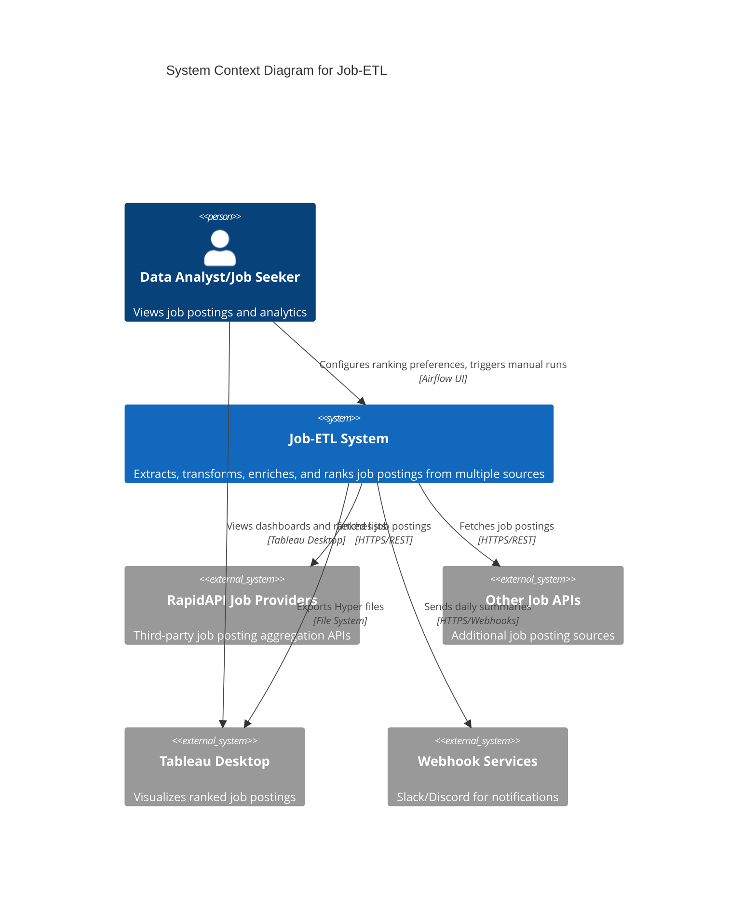
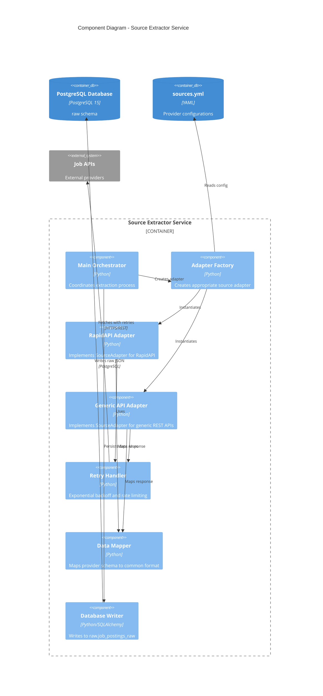
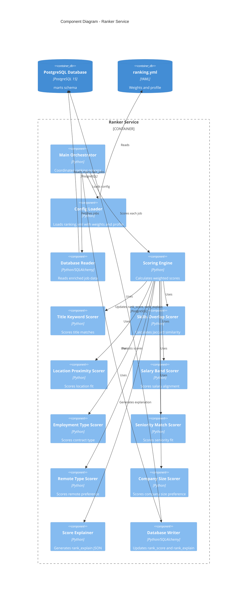
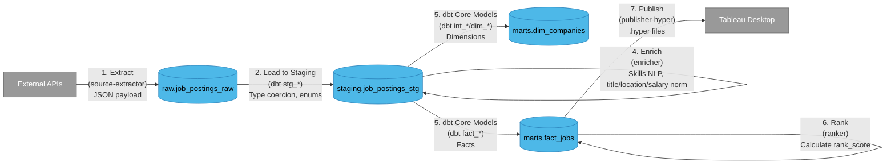
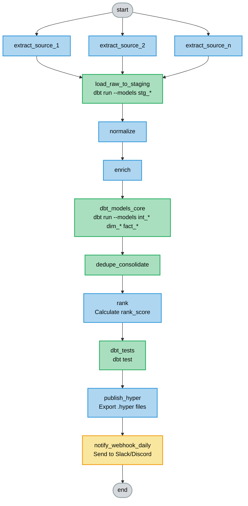
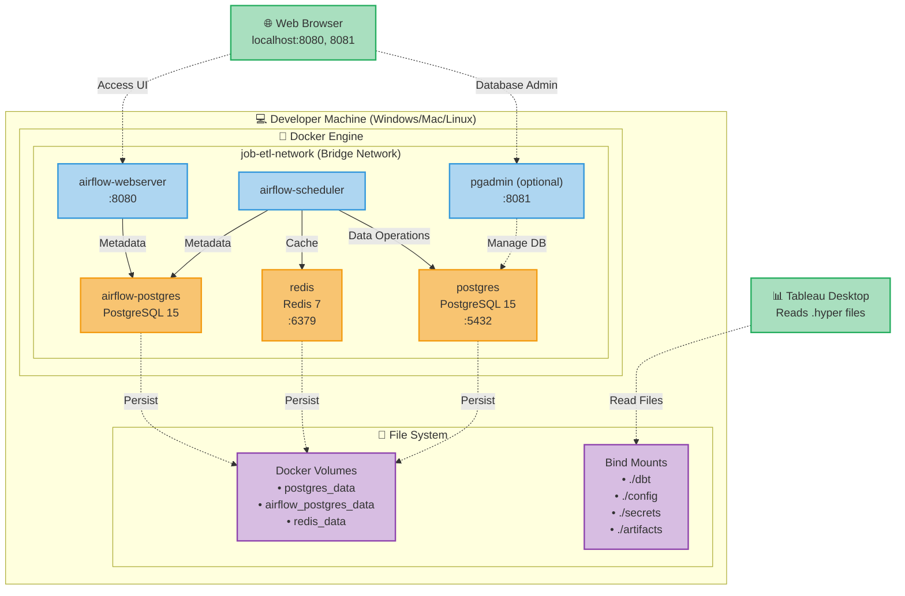
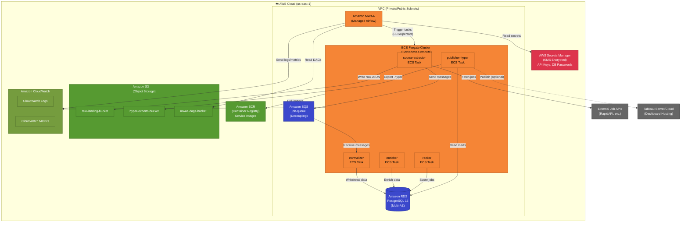
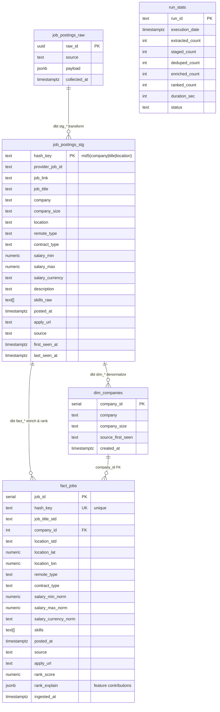

# Job-ETL C4 Architecture Diagrams

This document contains C4 model diagrams for the Job-ETL system at multiple abstraction levels using **Mermaid**.

> **Note:** These diagrams render natively in GitHub, VS Code (with Markdown Preview), GitLab, and many other tools without plugins!

---

## ETL Pipeline Flow Diagram

For a detailed interactive flowchart of the daily ETL pipeline, see:

**[📊 View/Edit ETL Flow Diagram](job-etl-flow.drawio)**

This diagram shows:
- Complete Airflow DAG task flow (`jobs_etl_daily`)
- All microservices and their connections
- Database schemas (raw → staging → marts)
- External systems (JSearch API, SMTP, Tableau)
- Data flow arrows and service call relationships

**How to use:**
- **View on GitHub**: Click the link above (GitHub will show the XML, but you can download it)
- **Edit in Draw.io**: 
  1. Go to https://app.diagrams.net/
  2. File → Open from → Device
  3. Select `docs/architecture/job-etl-flow.drawio`
  4. Make your edits
  5. File → Save As → Save to your device
  6. Commit the updated file to git
- **Direct GitHub integration**: Use this URL format (replace `YOUR_USERNAME` with your GitHub username):
  ```
  https://app.diagrams.net/?mode=github#YOUR_USERNAME/job-etl/main/docs/architecture/job-etl-flow.drawio
  ```

---

## Level 1: System Context Diagram

Shows the Job-ETL system and its external dependencies from a high-level perspective.



---

## Level 2: Container Diagram

Shows the internal architecture of the Job-ETL system with all containers (services, databases, applications).

```mermaid
C4Container
    title Container Diagram for Job-ETL System

    Person(user, "Data Analyst", "Manages and views job data")

    Container_Boundary(job_etl, "Job-ETL System") {
        Container(airflow_web, "Airflow Webserver", "Python/Flask", "Provides orchestration UI and API")
        Container(airflow_scheduler, "Airflow Scheduler", "Python", "Schedules and triggers DAG runs")
        
        Container(source_extractor, "Source Extractor", "Python/FastAPI", "Fetches raw job postings from external APIs")
        Container(normalizer, "Normalizer", "Python", "Transforms provider-specific data to canonical format")
        Container(enricher, "Enricher", "Python/spaCy", "Extracts skills, normalizes titles, locations, salaries")
        Container(ranker, "Ranker", "Python", "Scores jobs based on configurable weights")
        Container(publisher_hyper, "Publisher", "Python/Tableau Hyper API", "Generates Hyper files for Tableau")
        
        Container(dbt, "dbt Transformations", "dbt-core", "SQL transformations: staging → marts")
        
        ContainerDb(postgres, "PostgreSQL Database", "PostgreSQL 15", "Stores raw, staging, and marts data")
        ContainerDb(airflow_postgres, "Airflow Metadata DB", "PostgreSQL 15", "Stores Airflow metadata")
        ContainerDb(redis, "Redis Cache", "Redis 7", "Caches Airflow state")
        
        Container(config, "Configuration Files", "YAML", "sources.yml, ranking.yml, taxonomy files")
    }

    System_Ext(external_apis, "Job APIs", "RapidAPI and other providers")
    System_Ext(tableau, "Tableau Desktop", "Visualization tool")
    System_Ext(webhooks, "Webhook Services", "Slack/Discord")

    Rel(user, airflow_web, "Manages DAGs, views logs", "HTTPS:8080")
    Rel(user, tableau, "Views dashboards", "Hyper files")

    Rel(airflow_web, airflow_postgres, "Reads/writes metadata", "PostgreSQL")
    Rel(airflow_scheduler, airflow_postgres, "Reads/writes metadata", "PostgreSQL")
    Rel(airflow_scheduler, redis, "Caches state", "Redis Protocol")

    Rel(airflow_scheduler, source_extractor, "Triggers extraction", "Docker exec")
    Rel(airflow_scheduler, normalizer, "Triggers normalization", "Docker exec")
    Rel(airflow_scheduler, enricher, "Triggers enrichment", "Docker exec")
    Rel(airflow_scheduler, ranker, "Triggers ranking", "Docker exec")
    Rel(airflow_scheduler, publisher_hyper, "Triggers publishing", "Docker exec")
    Rel(airflow_scheduler, dbt, "Runs transformations", "CLI")

    Rel(source_extractor, external_apis, "Fetches job postings", "HTTPS/REST")
    Rel(source_extractor, postgres, "Writes raw JSON", "PostgreSQL:5432")
    Rel(source_extractor, config, "Reads source configs", "File System")

    Rel(dbt, postgres, "Transforms: raw → staging", "PostgreSQL:5432")
    Rel(normalizer, postgres, "Reads staging, writes normalized", "PostgreSQL:5432")
    Rel(enricher, postgres, "Reads/writes enriched data", "PostgreSQL:5432")
    Rel(enricher, config, "Reads taxonomy configs", "File System")
    Rel(ranker, postgres, "Reads enriched, writes scores", "PostgreSQL:5432")
    Rel(ranker, config, "Reads ranking.yml", "File System")
    Rel(publisher_hyper, postgres, "Reads marts", "PostgreSQL:5432")
    Rel(publisher_hyper, tableau, "Exports Hyper files", "File System")
    Rel(airflow_scheduler, webhooks, "Sends notifications", "HTTPS")

    UpdateLayoutConfig($c4ShapeInRow="3", $c4BoundaryInRow="1")
```



---

## Level 3: Component Diagram - Source Extractor

Details the internal components of the Source Extractor service.



---

## Level 3: Component Diagram - Ranker Service

Details the internal components of the Ranker service.



---

## Data Flow Diagram

Shows the data transformation pipeline from extraction to publication.



### Schema Details

**raw.job_postings_raw**
- `raw_id` (uuid pk)
- `source` (text)
- `payload` (jsonb)
- `collected_at` (timestamp)

**staging.job_postings_stg**
- `hash_key` (text pk) = md5(company|title|location)
- `job_title`, `company`, `location`
- `remote_type`, `contract_type`
- `salary_min/max`, `currency`
- `skills_raw` (text[])
- `first_seen_at`, `last_seen_at`

**marts.fact_jobs**
- `job_id` (surrogate key)
- `hash_key` (unique)
- `job_title_std`, `company_id` (fk)
- `location_std`, `lat/lon`
- `skills` (text[])
- `rank_score`, `rank_explain` (jsonb)

---

## Airflow DAG Diagram

Shows the task dependencies in the main Airflow DAG.



**Schedule:** Daily at 07:00 America/Toronto

**Task Types:**
- 🔵 **Docker Service** - Containerized microservices
- 🟢 **dbt Task** - SQL transformations and tests
- 🟡 **Webhook** - Notification services
- ⚪ **Dummy Task** - Pipeline markers

**Notes:**
- `extract_source_*` are dynamically mapped from `sources.yml`
- Each task has `retries=3` with exponential backoff
- All operations are idempotent (safe to re-run)

---

## Deployment Diagram - Local (Docker Compose)

Shows the physical deployment architecture for local development.



**Key Components:**
- **Containers:** Run microservices and Airflow components
- **Databases:** PostgreSQL for data + metadata, Redis for caching
- **Volumes:** Persistent storage for database data
- **Bind Mounts:** Live sync of code, config, secrets, and artifacts

**Ports:**
- `8080` - Airflow UI
- `8081` - pgAdmin (optional)
- `5432` - PostgreSQL
- `6379` - Redis

---

## Deployment Diagram - AWS (Phase 2)

Shows the planned AWS architecture for production deployment.



**AWS Services:**
- 🟠 **MWAA** - Managed Airflow for orchestration
- 🟠 **ECS Fargate** - Serverless container compute
- 🟢 **S3** - Object storage for raw data, DAGs, and exports
- 🔵 **RDS PostgreSQL** - Managed database (Multi-AZ)
- 🔵 **SQS** - Message queue for decoupling services
- 🔴 **Secrets Manager** - KMS-encrypted secrets with rotation
- 🟡 **CloudWatch** - Centralized logs and metrics
- 🟢 **ECR** - Private container registry

**Benefits:**
- ✅ Fully managed services (less operational overhead)
- ✅ Auto-scaling with Fargate
- ✅ High availability (Multi-AZ RDS)
- ✅ Decoupled architecture with SQS
- ✅ Secure secrets management with KMS encryption

---

## Database Schema Diagram

Shows the relationships between database tables across schemas.



### Schema Organization

**📦 raw** - Provider JSON + minimal parsing
- Preserves original API responses
- JSONB for flexibility

**📦 staging** - Flattened provider-agnostic tables
- Canonical format across all sources
- Deduplication via `hash_key`
- Tracks `first_seen_at` and `last_seen_at`

**📦 marts** - Curated dimensions and facts for Tableau
- Star schema design
- Normalized dimensions (`dim_companies`)
- Enriched facts with scores (`fact_jobs`)
- Explainable AI with `rank_explain` JSON

### Key Concepts

**Deduplication Key:**
```sql
hash_key = md5(
  lower(normalize_ws(company)) || '|' ||
  lower(normalize_ws(job_title)) || '|' ||
  lower(normalize_ws(location))
)
```

**Rank Explainability:**
```json
{
  "title_keywords": 0.95,
  "skills_overlap": 0.80,
  "location_proximity": 1.0,
  "salary_band": 0.75,
  "employment_type": 1.0,
  "seniority_match": 0.85,
  "remote_type": 1.0,
  "company_size": 0.70
}
```

---

## How to View These Diagrams

### ✅ Option 1: GitHub/GitLab (Recommended)
**No installation required!** These Mermaid diagrams render automatically when you view this file on:
- GitHub
- GitLab
- Azure DevOps
- Bitbucket

Just open the file in your browser and scroll through!

### ✅ Option 2: VS Code (Built-in)
1. Open this file in VS Code
2. Click the **"Open Preview"** button (top-right corner)
3. Or press: `Ctrl+Shift+V` (Windows/Linux) or `Cmd+Shift+V` (Mac)
4. Diagrams render automatically! ✨

**No extensions needed!** VS Code has native Mermaid support in Markdown preview.

### ✅ Option 3: Enhanced VS Code Preview
For better rendering with pan/zoom:

1. Install extension: **"Markdown Preview Mermaid Support"** by Matt Bierner
2. Open this file
3. Use preview as above
4. Get interactive diagrams with better styling

### ✅ Option 4: Mermaid Live Editor
1. Visit: https://mermaid.live/
2. Copy any diagram code block
3. Paste in the editor
4. View, edit, and export (PNG, SVG, PDF)

### ✅ Option 5: IntelliJ/PyCharm
1. Install plugin: **"Mermaid"**
2. Open this file
3. Preview pane shows diagrams automatically

### ✅ Option 6: Command Line (Export to Images)
```bash
# Install Mermaid CLI
npm install -g @mermaid-js/mermaid-cli

# Export all diagrams to PNG
mmdc -i docs/architecture/c4-diagrams.md -o docs/architecture/diagrams/

# Export to SVG (better quality)
mmdc -i docs/architecture/c4-diagrams.md -o docs/architecture/diagrams/ -t svg

# Export single diagram
mmdc -i diagram.mmd -o diagram.png
```

---

## Diagram Maintenance

When updating the architecture:
1. Update `specification.md` first
2. Update corresponding C4 diagram(s)
3. Keep all levels synchronized
4. Regenerate images if using static exports
5. Test rendering in GitHub preview

---

## Quick Start

**Viewing diagrams right now:**
1. If you're on GitHub/GitLab: You're already seeing them! 🎉
2. If you're in VS Code: Press `Ctrl+Shift+V` (or `Cmd+Shift+V`)
3. If neither: Copy a diagram to https://mermaid.live/

---

## Additional Resources

- [C4 Model Documentation](https://c4model.com/)
- [Mermaid Documentation](https://mermaid.js.org/)
- [Mermaid Live Editor](https://mermaid.live/)
- [Job-ETL Specification](../specification.md)
- [Job-ETL TODO](../TODO.md)

---

## Why Mermaid?

✅ **Native GitHub/GitLab support** - No plugins needed  
✅ **Built into VS Code** - Instant preview  
✅ **Text-based** - Easy to version control  
✅ **Simple syntax** - Faster to write and maintain  
✅ **Wide tool support** - Works everywhere  
✅ **Export options** - Can generate PNG/SVG/PDF when needed

